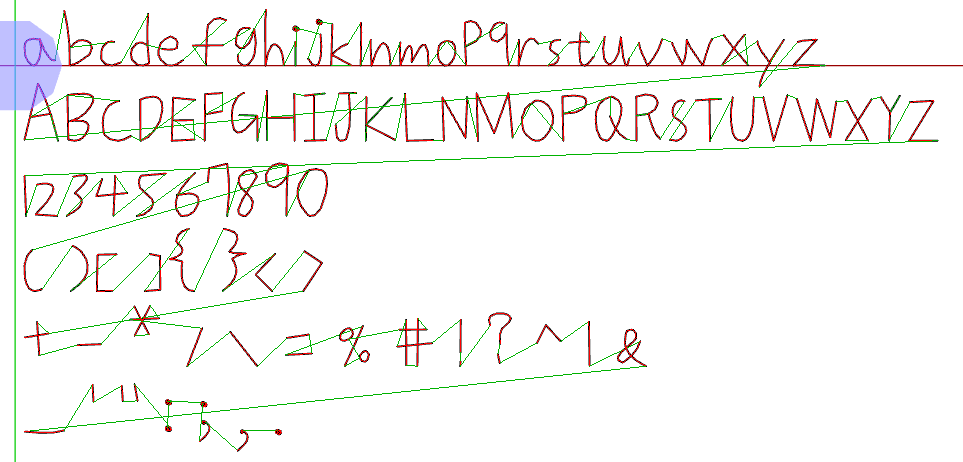

# 文字檔轉Gcode路徑產生器
由於網路上沒有看到現成的轉換方案，<br />
因此自己創造一個手寫路徑字庫，<br />
此程式能夠幫助你把.txt傳換成Gcode路徑，<br />
且能夠在程式中修改字體大小的參數，
並支持換頁續印功能，
適合自製繪圖機使用
## Features
目前能夠轉換:
* 英文字母大小寫
* 數字0~9
* 4種程式常用括號
* 14種程式常用符號
* 6種數學運算符號
* 1個保留方塊
<p align="center">
    
</p>

程式設定:
* 每頁能寫的最大行數
* 每行高度
* 字體大小縮放倍率
* 超出繪圖範圍警告

```c++
#define Max_line 30 //最大行數
#define layer_hight 7.9 //行高
#define scale 1 //字體縮放
#define Max_X 170 //超出繪圖範圍警告
```
## Demo
<p align="center">
    
</p>

## In operation
<p align="center">
    
</p>
